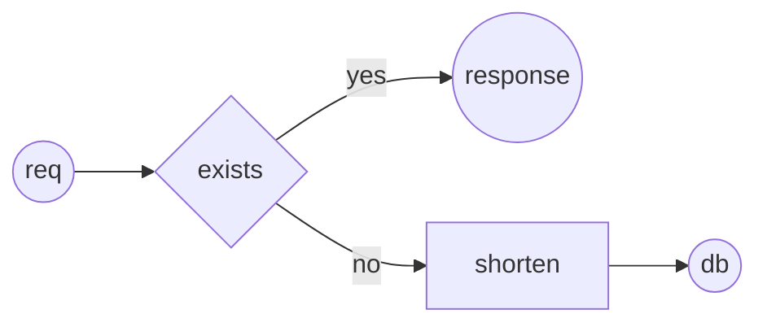

# UrlShortner

##  meant as a learning exercise

## Routes:

|Verp|Route|Name|
|---|---|---|
|GET|/|home|
|Post|/url|shorten Url|
|Get|/{URL KEY}| redirect|

## Classes : 

|Name|Job|Methods|
|---|---|---|
|Helpers| helpers| |
|||Create_secret_key|
|URL|model||
