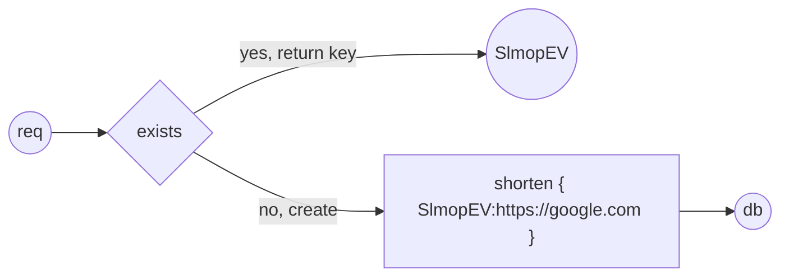

# UrlShortner

##  meant as a learning exercise


### to run:
- clone then cd into it
- activate the virtual env:
```
win \n
venv\scripts\activate
\n
unix \n
source venv/bin/activate
```
- then run : 
```
uvicorn UrlShortner.main:app --port <port> --reload
uvicorn UrlShortner.main:app --port 8976 --reload
```



## Routes:

|Verp|Route|Name|
|---|---|---|
|GET|/|home|
|Post|/url|shorten Url|
|Get|/{URL KEY}| redirect|


## Classes : 

|Name|Job|Methods|
|---|---|---|
|Helpers| helpers| |
|||Create_secret_key|
|URL|model||
